# "*Rules are made to be broken...*"
A Honkai: Star Rail-themed crossover mod for Balatro. This aims to be a vanilla-friendly mod.

Obtain Light Cone Jokers in order to survive the new Path-themed boss blinds!

"*Bust? Or... maybe **I'll take it ALL!***"

**This mod is currently in a pre-alpha state and should not be used for regular gameplay.**

# Installation
Place the [latest release](https://github.com/sephdotmp3/balatro-x-star-rail/releases) in your `mods` folder or `git clone https://github.com/sephdotmp3/balatro-x-star-rail/` it into your `mods` folder.

# New Jokers
## Common Jokers
### Day One of My New Life
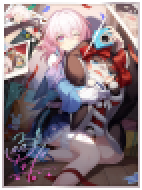

Played **7s** give **+7** Chips and **+7** Mult when scored

### Earthly Escapade
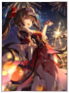

Randomly gives **+30** Chips, **+4** Mult, **$3**, or **X2** Mult when scored

### Echoes of the Coffin
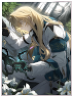

At the end of the round, gives **$1** for every **5** cards remaining in the **deck**

### I Venture Forth To Hunt

Enhanced cards give **+25** Chips when scored

### If Time Were A Flower
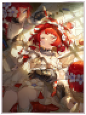

Retrigger each card when playing a **Three of a Kind**

### Night of Fright

Disables the current **Boss Blind** when there is 1 Hand remaining

### Shadowed By Night

Every card in a **High Card** gives **2x** Mult when scored

### This Love, Forever

This Joker gains **+3** Mult for every **Arcana** and **Spectral** Pack opened

## Uncommon Jokers
### Final Victor

This Joker gains **X0.2** Mult each time a card is scored (max 15 times)

### Holiday Thermae Escapade
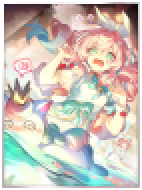

This Joker gains **75%** of each played **poker hand's** base Chips, but clears **50%** after scoring

### In The Night

**+1 in 5** chance for **X3** Mult per **Joker** card, **+3** Mult otherwise

### Inherently Unjust Destiny

Retrigger played cards with **Spade** suit

### Poised to Bloom
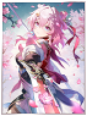

Retrigger all played **7s** twice

### Reforged Remembrance
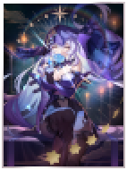

Every other **Blind**, create a **Spectral** card when **Blind** is selected (Must have room)

### The Unreachable Side
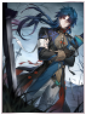

This Joker gives **X0.5** Mult for every hand played (Resets after round end)

### Though Worlds Apart
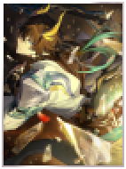

**Stone Cards** give **1.5X** Mult

### Today Is Another Peaceful Day
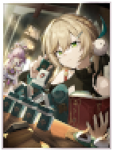

This Joker gains **+20** Chips for every **Four of a Kind** played

### Yet Hope Is Priceless

Start with **-3** hand size, gain **+1** hand size for every **play** or **discard** (Resets after round end)

## Rare Jokers
### A Secret Vow
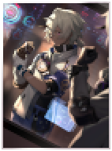

This Joker gives **+1** Mult for every **2%** score below the blind's required score

### Along The Passing Shore

This Joker gains **+2** Mult per played hand, every debuffed card in played hand multiplies this tally by **1.5x**

### But the Battle Isn't Over
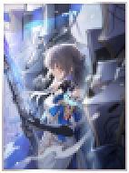

Retrigger all **Common** Jokers

### Time Woven Into Gold

Playing your most played **poker hand** grants **+1** hand, but **-1** hand size (resets after round end, hand size will not go below 5)

### Thus Burns the Dawn
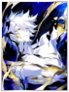

After selling **12** Jokers, sell this card to gain **+1 Joker Slot**

### To Evernight's Stars
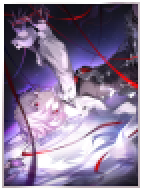

Played **7s** give **1.7X** Mult when scored

### Worrisome, Blissful

Gives $ logarithmically based on how much you scored over the **Blind's** required score (ex: ~150% total score -> **$6**, ~200% -> **$10**, ~300% -> **$15**) (Max **$25**)

## Legendary Jokers
### Cruising in the Stellar Sea
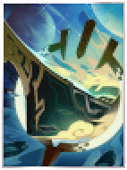

Every Enhanced Joker, Enhanced card played, and Enhanced card in your hand gives **X1.5** Mult

### Memory's Curtain Never Falls
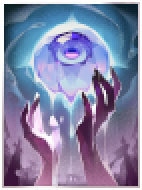

Sell this card to create **Negative** copies of **Day One of My New Life**, **Poised to Bloom**, and **To Evernight's Stars**

### Eternal Calculus

This Joker gains **X0.1** Mult for every card played

### Texture of Memories

Prevents Death once, then **self-destructs**

# New Blinds
## Boss Blinds
### The Abundance
TODO: gif for this

If played hand doesn't beat blind, add 50% of its score to the blind's required score

### The Destruction

Played cards are destroyed after scoring

### The Elation

Start with a random number of hands and discards, reward and required score is randomized

### The Erudition

Must play (most played hand) on odd hands, but cannot play (most played hand) on even hands

### The Harmony
TODO: gif for this

All played cards must have the same rank or suit

### The Nihility

Playing a (most played hand) debuffs a random Joker during the next hand

### The Preservation

Every $5 below $20 increases blind's required score by 1X base score

### The Propagation
TODO: gif for this

Every other card played adds a Swarm Card to your deck

### The Remembrance

Every type of card that isn't found in your first hand will be flipped for the rest of the blind

### The Hunt

A (most played hand) is worth 0.4x, but all other hands are worth 1.5x

## Finisher Blinds
### Bionic Messiah
TODO: gif for this

If a played (most played hand) does not beat blind, add its score to this blind's required score

### Calamity Worker
TODO: gif for this

Adds a Swarm Card to your deck for every $1 below the number of cards in your deck

### Conflict Author
TODO: gif for this

After play, randomly destroys played hand, all cards in hand, or a random Joker

### Note Thief
TODO: gif for this

Odd hands must contain only one type of card, but even hands cannot contain duplicate cards

### Relative Tracer
TODO: gif for this

Debuffs every type of card that isn't found in your first hand, cannot play hands with debuffed cards