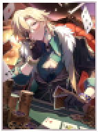
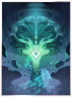
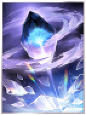

# "*Rules are made to be broken...*"
A Honkai: Star Rail-themed crossover mod for Balatro. This aims to be a vanilla-friendly mod.

Obtain Light Cone Jokers in order to survive the new Path-themed boss blinds!

"*Bust? Or... maybe **I'll take it ALL!***"

**This mod is currently in a pre-alpha state and should not be used for regular gameplay.**

# Installation
Place the [latest release](https://github.com/sephdotmp3/balatro-x-star-rail/releases) in your `mods` folder or `git clone https://github.com/sephdotmp3/balatro-x-star-rail/` it into your `mods` folder.

# New Jokers
## Common Jokers
### Shadowed By Night

Every card in a **High Card** gives **2x** Mult when scored

### This Love, Forever

This Joker gains **+3** Mult for every **Arcana** and **Spectral** Pack opened

## Uncommon Jokers

This Joker gains **X0.2** Mult each time a card is scored (max 15 times)

### In The Night

**2 in 3** chance for **2.5X** Mult, **+4** Mult otherwise

### Inherently Unjust Destiny

Retrigger played cards with **Spade** suit

### Yet Hope Is Priceless

TODO: balance this thing

## Rare Jokers
### Along The Passing Shore

This Joker gains **+2** Mult per played hand, every debuffed card in played hand multiplies this tally by **1.5x**

### Time Woven Into Gold

Playing your most played **poker hand** grants **+1** hand, but **-1** hand size (resets after round end)

## Legendary Jokers
### Eternal Calculus

This Joker gains **X0.1** Mult for every card played

### Texture of Memories

Prevents Death once, then **self-destructs**

# New Boss Blinds
TODO: gifs for each of these
### The Abundance
If played hand doesn't beat blind, add 50% of its score to the blind's required score

### The Destruction
Played cards are destroyed after scoring

### The Elation
Start with a random number of hands and discards, reward and required score is randomized

### The Erudition
TODO: write this blind

### The Harmony
All played cards must have the same rank or suit

### The Nihility
Playing a (most played hand) debuffs a random Joker during the next hand

### The Preservation
Every $5 below $20 increases blind's required score by 1X base score

### The Propagation
TODO: write this blind

### The Remembrance
TODO: write this blind

### The Hunt
A (most played hand) is worth 0.4x, but all other hands are worth 1.5x